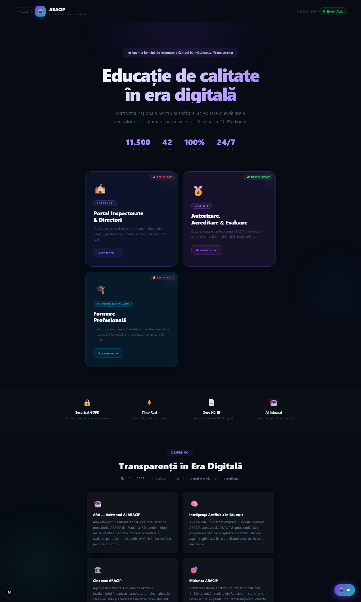
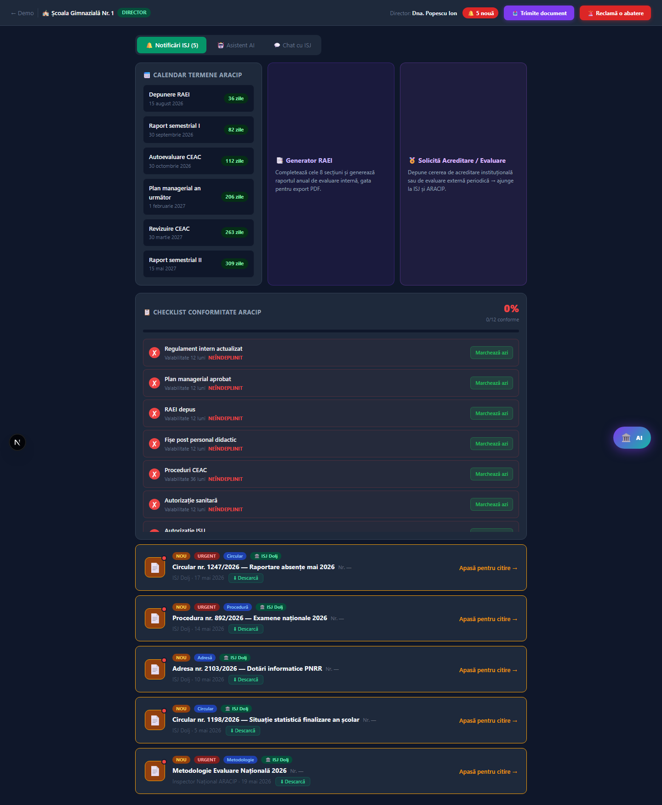
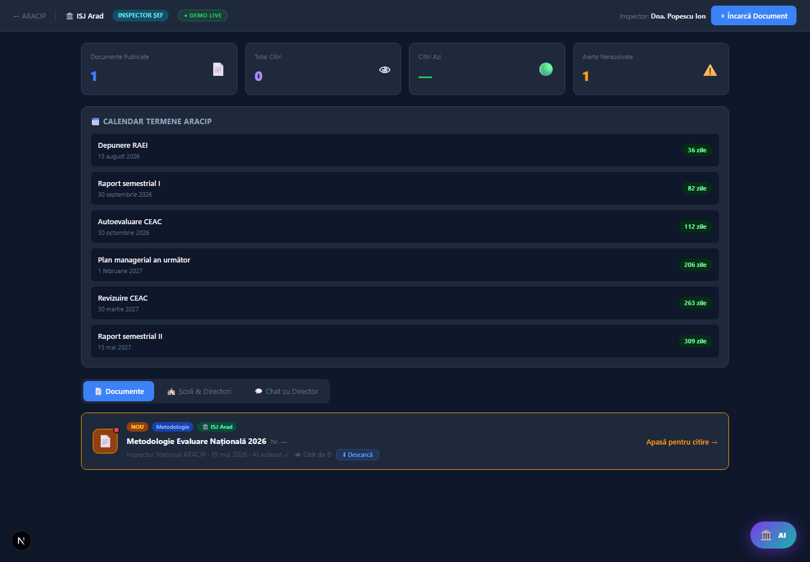
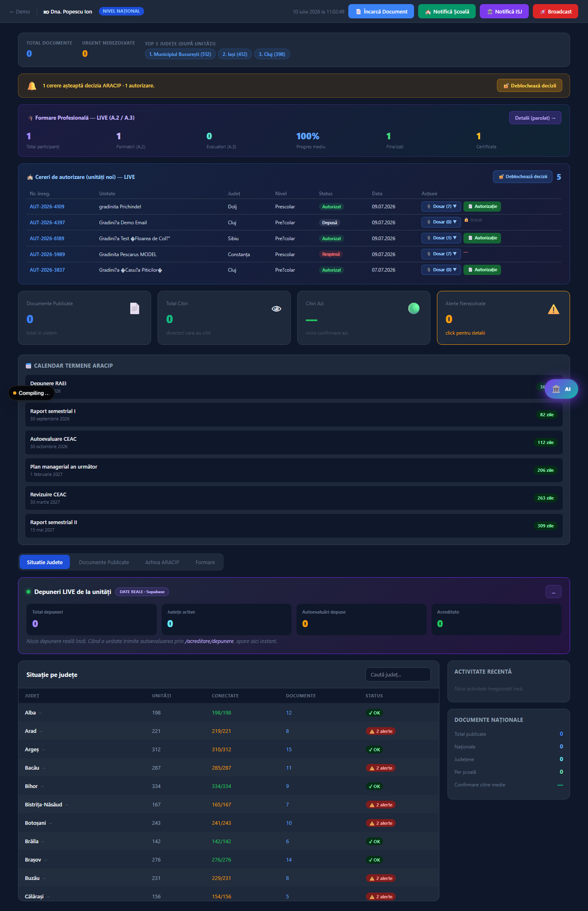

# Manuale de utilizare și documentație tehnică — Platforma ARACIP

**Furnizor:** NEWTIME CONCEPT SOLUTIONS S.R.L. · CUI 38803627 · J2018000242160
**Aplicație:** Platformă digitală de asigurare a calității în învățământul preuniversitar
**Acces demonstrativ:** https://aicraiova.ro/aracip
**Versiune:** 2.0

## Cuprins
- Partea I — Manuale de utilizare (per rol)
- Partea II — Documentație tehnică

---

# PARTEA I — MANUALE DE UTILIZARE

Fiecare rol are un parcurs propriu. Credențialele demonstrative sunt: parola **ARACIP** pentru zonele securizate; zona de autorizare/acreditare este publică.

## 1. Fondator / solicitant de autorizare (unitate nouă)

**Rol:** persoană fizică sau juridică ce înființează o unitate de învățământ, ori o unitate existentă care solicită autorizare pentru un nivel/o specializare nouă. **Nu necesită cont.**

### 1.1. Depunerea dosarului de autorizare
1. Accesează `aicraiova.ro/acreditare` și apasă cardul **Autorizare** (marcat „acces public").
2. Parcurge formularul ghidat (6 pași):
 - **Pasul 1 — Date de identificare:** tip solicitant (unitate nouă / unitate existentă), denumire, CUI/CIF, adresă, reprezentant legal, **e-mail** (obligatoriu) și **telefon**, județ.
 - **Pasul 2 — Structura unității:** nivel de învățământ, profil/specializare, capacitate (număr de copii/elevi).
 - **Pasul 3 — Spații și dotări:** număr de săli, suprafață totală.
 - **Pasul 4 — Cadre didactice:** se anexează lista (la Pasul 5), în format Excel/PDF.
 - **Pasul 5 — Documente anexe:** se încarcă, pe rând, cele 7 documente oficiale (proiect de dezvoltare instituțională, ofertă educațională, acte privind spațiile/extras CF, listă dotări, aviz ISU, aviz DSP, regulament intern). Formate: PDF, Word, Excel, imagini; max 10 MB/fișier.
 - **Pasul 6 — Confirmare:** verifică sumarul, bifează acordul GDPR și apasă **Trimite dosarul**.
3. Aplicația afișează **numărul de înregistrare** (ex. `AUT-2026-3837`) și trimite un **e-mail de confirmare**. Notează numărul.

### 1.2. Verificarea stadiului (fără cont)
1. Accesează `aicraiova.ro/acreditare/autorizare/stadiu`.
2. Introdu **numărul cererii + adresa de e-mail** folosită la depunere → apasă **Verifică stadiul**.
3. Vezi parcursul: **Depusă → În analiză → Autorizat / Respinsă** (cu motiv, dacă e cazul).
4. Dacă e **Autorizat**, apasă **Descarcă Autorizația de Funcționare Provizorie (PDF)**.
5. La fiecare decizie ARACIP primești automat **e-mail**.

## 2. Director de unitate

**Rol:** conducerea unei unități autorizate/acreditate. Acces: `aicraiova.ro/demo/director`, autentificare cu titlu, nume, e-mail și parolă.

- **Documente și circulare:** vezi documentele primite de la ISJ și ARACIP; apasă un document necitit pentru a-l marca **„citit"** (confirmarea ajunge înapoi la ISJ/ARACIP). Documentele cu fișier atașat se pot **descărca**.
- **Asistentul ARA:** apasă butonul asistentului (dreapta-jos); îți semnalează proactiv cel mai urgent termen cu acțiunea exactă și răspunde la întrebări; pe acest portal poate răspunde și **vocal**.
- **Calendarul termenelor** și **lista de verificare a conformității** — pentru pregătirea documentelor.
- **Generator RAEI:** apasă cardul „Generator RAEI"; completează datele (unitate, nivel, an școlar, număr elevi, detalii) → se salvează și apare la ISJ și la ARACIP.
- **Solicitare acreditare / evaluare periodică:** apasă cardul „Solicită Acreditare / Evaluare" (`/demo/director/solicitari`); alege tipul, completează denumire, CUI, județ, nivel, **e-mail** (și calificativul la evaluarea periodică) → primești număr de înregistrare + e-mail de confirmare, iar la decizie ești notificat pe e-mail.

## 3. Inspector școlar județean (ISJ)

**Rol:** monitorizarea unităților din județ. Acces: `aicraiova.ro/demo/isj`, autentificare + **alegerea județului**.

- **Monitorizare LIVE pe județ:** blocul „Asigurarea calității în județ" arată autoevaluările depuse, RAEI-urile generate și cererile de autorizare din județul ales.
- **Încărcare documente către directori:** apasă „Încarcă Document"; alege tipul (Circular/Procedură/Adresă/Decizie), destinatarii (toate unitățile sau un tip: licee/colegii/școli/grădinițe), completează titlu, conținut, termen, marcaj urgent, atașează fișier → se publică și se notifică directorii. Numărul de înregistrare se generează automat.
- **Confirmări de citire:** vezi ce directori au citit fiecare document și când.
- **Comunicare** cu directorii (chat).

## 4. Inspector Național ARACIP

**Rol:** decizia și monitorizarea la nivel național. Acces: `aicraiova.ro/demo/inspector`, autentificare.

- **Tabloul central:** statistici formare, RAEI, autoevaluări, cereri de autorizare și de acreditare/evaluare, situația pe cele 42 de județe.
- **Luarea deciziilor:**
 1. Apasă **Deblochează decizii** → introdu parola ARACIP (fereastră dedicată).
 2. Pe rândul unei cereri, apasă **Dosar** pentru a vedea și **descărca documentele** depuse (proxy securizat).
 3. Apasă **Acceptă** sau **Respinge** (la respingere se deschide o fereastră pentru **motiv**, care ajunge în e-mailul solicitantului).
 4. La aprobare, apasă **Autorizație / Decizie / Atestat** pentru a genera documentul oficial **PDF**.
- **Notificare automată:** solicitantul/directorul primește e-mail cu decizia.
- **Arhiva de documente oficiale** și **administrarea cunoștințelor ARA** (`/admin/ara`).

## 5. Formabil (A.2) și Evaluator extern (A.3)

**Rol:** participant la programul de formare. Acces: pe `aicraiova.ro/aracip`, cardul **Formare Profesională** → alege rolul, introdu nume + e-mail + acord GDPR + parola **ARACIP**.

- **E-Learning:** parcurge cele 6 cursuri; fiecare are lecții și un test de verificare cu prag de promovare; progresul se salvează.
- **Simulare (după rol):** formabil → simularea autoevaluării (cei 24 de indicatori); evaluator → simularea evaluării externe (analiză documente, vizită, triangulare, raport).
- **Certificat:** la finalizare, descarcă **certificatul nominal PDF**.

## 6. Administrator ARA

**Rol:** actualizarea cunoștințelor asistentului ARA. Acces: `aicraiova.ro/admin/ara`, parolă de administrator.

- **5 tab-uri:** Documente ISJ, Module, Anunțuri, General, Arhiva Documente.
- Se adaugă/editează informații pe care ARA le folosește imediat (fără atingerea codului).
- **Arhiva Documente:** se încarcă documente oficiale (PDF/Word/text); textul e extras automat și devine sursă de citare pentru ARA.

---

# PARTEA II — DOCUMENTAȚIE TEHNICĂ

## 1. Arhitectură

- **Aplicație:** Next.js (App Router, TypeScript), randare server + client, funcții serverless.
- **Bază de date:** Supabase (PostgreSQL), regiune UE — Irlanda (`eu-west-1`), acces server-side cu Row Level Security.
- **Stocare fișiere:** Vercel Blob (privat) — documente dosare, arhivă, index documente.
- **AI:** Groq, model `llama-3.3-70b-versatile` (asistentul ARA).
- **E-mail:** Resend (tranzacțional, domeniu verificat).
- **Găzduire:** Vercel (CDN global + serverless).
- **Principiu de reziliență:** degradare grațioasă — dacă lipsește o cheie (bază de date, blob, AI, e-mail), aplicația continuă să funcționeze fără erori vizibile.

## 2. Model de date (tabele principale Supabase)

| Tabelă | Rol | Câmpuri-cheie |
|--------|-----|---------------|
| `formare_progress` | Progres e-learning per participant | user_id, role, progress, details (nume/email/unitate/județ) |
| `autoevaluare_reports` | Rapoarte simulare autoevaluare (A.2) | user_id, details |
| `evaluare_reports` | Rapoarte simulare evaluare externă (A.3) | user_id, details |
| `unitati_calitate` | Autoevaluări depuse (lanțul calității) | nume_unitate, județ, tip, localitate, status, calificativ_general, calificative_domenii, calificative pe indicatori |
| `raei_generate` | RAEI generate de directori | nume_unitate, județ, localitate, nivel, an_scolar, nr_elevi, details |
| `cereri_autorizare` | Dosare autorizare | nr_inregistrare, denumire, tip_solicitant, cui, județ, adresă, reprezentant, nivel, capacitate, documente, **email, telefon**, status, **motiv, decizie_at** |
| `cereri_evaluare` | Acreditare + evaluare periodică | nr_inregistrare, tip, denumire, cui, județ, nivel, calificativ, **email**, status, **motiv, decizie_at** |
| `ara_archive` | Arhiva documente oficiale (RAG) | titlu, tip, text_content, text_preview, județ |
| `cereri_stergere` | Cereri GDPR de ștergere | email, motiv |

RLS este activat pe toate tabelele; scrierea se face exclusiv server-side, cu cheia de serviciu.

## 3. Interfețe API (rezumat)

| Endpoint | Metode | Rol |
|----------|--------|-----|
| `/api/autorizare` | POST/GET/PATCH | Depunere, listare, decizie autorizare |
| `/api/autorizare/status` | GET | Verificare stadiu (nr + email, anti-enumerare) |
| `/api/autorizare/doc` | GET | Descărcare securizată documente dosar (proxy) |
| `/api/autorizare-upload` | POST | Încărcare documente dosar (blob privat) |
| `/api/evaluari` | POST/GET/PATCH | Acreditare + evaluare periodică |
| `/api/unitati` | POST/GET | Autoevaluări + agregate |
| `/api/raei` | POST/GET | RAEI |
| `/api/documents` | POST/GET/PATCH | Documente ISJ/ARACIP + confirmări citire |
| `/api/documents/[id]/download` | GET | Descărcare document (proxy) |
| `/api/upload-pdf` | POST | Upload + extragere text (PDF/Word/CSV) |
| `/api/formare-progress` | POST/GET | Progres formare |
| `/api/formare-reports` | POST | Rapoarte simulări |
| `/api/formare-admin` | POST | Situația participanților (protejat) |
| `/api/formare-stats` | GET | Statistici agregate formare |
| `/api/acreditare-chat` | POST | Asistent ARA |
| `/api/ara-knowledge` | GET/POST | Cunoștințe ARA (admin) |
| `/api/ara-archive` | GET/POST/DELETE | Arhivă documente oficiale |
| `/api/cereri-stergere` | POST | Cereri GDPR de ștergere |
| `/api/auth/check`, `/api/auth/session` | POST | Verificare parolă + sesiune |
| `/api/v1/{resource}` | GET | **API public REST** (cu cheie) |
| `/api/health` | GET | Verificare stare (monitorizare) |

## 4. Securitate

- HTTPS/TLS obligatoriu (HSTS).
- Antете de securitate: CSP, X-Frame-Options DENY, X-Content-Type-Options nosniff, Referrer-Policy, Permissions-Policy.
- Row Level Security pe toate tabelele; scriere doar server-side.
- Sesiuni semnate criptografic (HMAC-SHA256), cu expirare (12 ore) și comparație în timp constant.
- Documente cu date personale: blob privat + descărcare doar prin proxy server-side protejat cu parolă, cu restricție anti-SSRF (doar URL-uri din folderul propriu).
- Verificarea stadiului este anti-enumerare (nu confirmă o cerere fără potrivirea e-mailului).
- 2FA (TOTP) opțional pentru administratori (compatibil Google Authenticator).
- Rate limiting pe toate endpoint-urile publice.
- Parole și secrete exclusiv în variabile de mediu.

## 5. Variabile de mediu

| Variabilă | Rol |
|-----------|-----|
| `SUPABASE_URL`, `SUPABASE_ANON_KEY`, `SUPABASE_SERVICE_ROLE_KEY` | Bază de date |
| `BLOB_READ_WRITE_TOKEN` | Stocare fișiere |
| `GROQ_API_KEY` | Asistent ARA |
| `RESEND_API_KEY`, `EMAIL_FROM` | E-mail |
| `ADMIN_PASSWORD`, `ISJ_PASSWORD`, `INSPECTOR_PASSWORD`, `FORMABIL_PASSWORD`, `EVALUATOR_PASSWORD` | Acces pe roluri |
| `SESSION_SECRET` | Semnare sesiuni |
| `PUBLIC_API_KEY` | API public REST |
| `ADMIN_TOTP_SECRET` (opțional) | 2FA administrativ |

## 6. Implementare, actualizare, backup

- Cod versionat (Git); deploy pe Vercel (build automat) + alias pe domeniul de producție.
- Schema bazei de date în `supabase-schema.sql`; migrări idempotente (`add column if not exists`), rulate în consola SQL Supabase.
- **Recomandat în producție:** plan plătit al bazei de date (backup automat), monitorizare disponibilitate (ex. UptimeRobot pe `/api/health`), export periodic al datelor și fișierelor pentru recuperare.

## 7. Administrarea asistentului ARA

ARA folosește patru surse de cunoaștere (prompt de bază; cunoștințe admin; documente reale + termene; arhivă RAG). Actualizarea **fără cod** se face din `/admin/ara`:
- adăugarea de informații generale, module, anunțuri, documente ISJ;
- încărcarea documentelor oficiale în arhivă (text extras automat, citat de ARA).
Notă operațională: pe tariful Groq gratuit, dimensiunea contextului este plafonată; citarea integrală (verbatim) a documentelor din arhivă se activează pe un tarif Groq plătit.

---

*Documentație pregătită de NEWTIME CONCEPT SOLUTIONS S.R.L. Reflectă funcționalitatea reală a aplicației.*
